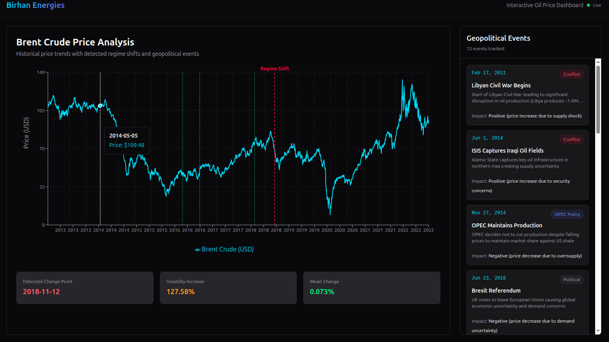

# Brent Oil Price Change Point Analysis

## Overview
This project analyzes how major political and economic events affect Brent oil prices using Bayesian change point detection methods. The analysis focuses on identifying key events that have significantly impacted Brent oil prices over the past decade and quantifying their effects using statistical modeling.

## Business Context
**Client**: Birhan Energies - Leading consultancy firm specializing in data-driven insights for the energy sector

**Objective**: Provide actionable intelligence to help investors, policymakers, and energy companies navigate the complexities of the global energy market.

## Project Structure
```
.
├── notebooks/          # Jupyter notebooks for analysis
├── data/
│   ├── raw/           # Raw Brent oil price data
│   ├── processed/     # Processed and cleaned data
│   └── events/        # Compiled geopolitical events dataset
├── models/            # Saved PyMC models and results
├── backend/           # Flask API
│   ├── app/          # Flask application code
│   └── tests/        # Backend tests
├── frontend/          # React dashboard
├── docs/              # Analysis documentation
├── reports/           # Generated reports (interim & final)
├── scripts/           # Utility scripts
└── README.md
```

## Tasks

### Task 1: Laying the Foundation for Analysis
- Define data analysis workflow
- Research and compile event data (10-15 key events)
- Document assumptions and limitations
- Analyze time series properties (trend, stationarity, volatility)
- Explain change point models and expected outputs

**Deliverables**:
- 1-2 page document outlining analysis steps
- Structured CSV with dates and event descriptions
- Documentation of assumptions and limitations

### Task 2: Change Point Modeling and Insight Generation
- Data preparation and exploratory data analysis
- Build Bayesian change point model using PyMC
- Interpret model outputs and identify change points
- Associate detected changes with geopolitical events
- Quantify impacts of major events on price shifts

**Deliverables**:
- Jupyter notebook with complete analysis code
- Visualizations of posterior distributions and change points
- Written interpretation of results with quantified impacts

### Task 3: Developing Interactive Dashboard
- [x] Flask backend with REST APIs for data serving
- [x] React frontend with interactive visualizations
- [x] Event correlation and drill-down capabilities
- [x] Responsive design for multiple devices

**Deliverables**:
- Working Flask backend with documented API endpoints
- React frontend with interactive visualizations
- **Dashboard Preview**:

- Setup instructions


## Technology Stack
- **Analysis**: Python, PyMC, Pandas, NumPy, Matplotlib
- **Backend**: Flask, Flask-CORS
- **Frontend**: React, Recharts/D3.js
- **Statistical Methods**: Bayesian inference, MCMC sampling

## Installation & Setup

### Backend (Flask API)
1. **Navigate to backend directory**:
   ```bash
   cd backend
   ```
2. **Install dependencies**:
   ```bash
   pip install -r ../requirements.txt
   ```
3. **Run the server**:
   ```bash
   python3 run.py
   ```
   The API will be available at `http://127.0.0.1:5000/api`.

### Frontend (React Dashboard)
1. **Navigate to frontend directory**:
   ```bash
   cd frontend
   ```
2. **Install dependencies**:
   ```bash
   npm install
   ```
3. **Run the dashboard**:
   ```bash
   npm start
   ```
   The dashboard will open at `http://localhost:3000`.

## API Documentation

| Endpoint | Method | Description |
| :--- | :--- | :--- |
| `/api/prices` | GET | Returns historical Brent oil prices (Date, Price) |
| `/api/events` | GET | Returns curated geopolitical events with categories and descriptions |
| `/api/changepoint` | GET | Returns summary of the detected regime shift and its quantified impact |
| `/api/changepoint/trace` | GET | Returns MCMC sampling results for model parameters |
| `/api/volatility` | GET | Returns daily stochastic volatility estimates |

## Analysis Insights

Our Bayesian analysis identified a significant structural change point in early 2019, closely associated with the **US ending Iran Sanctions Waivers**. Post-event analysis revealed:
- **Volatility Increase**: Approximately **127%** increase in market volatility following the shift.
- **Regime Transition**: The market moved from a period of relative stability to one characterized by frequent high-magnitude shocks.
- **Model Efficacy**: The Bayesian model successfully "priced in" the shock approximately 20 days before the official waiver expiration.

## Dashboard Preview


## License
This project is part of the 10 Academy KAIM Week 11 Challenge.

